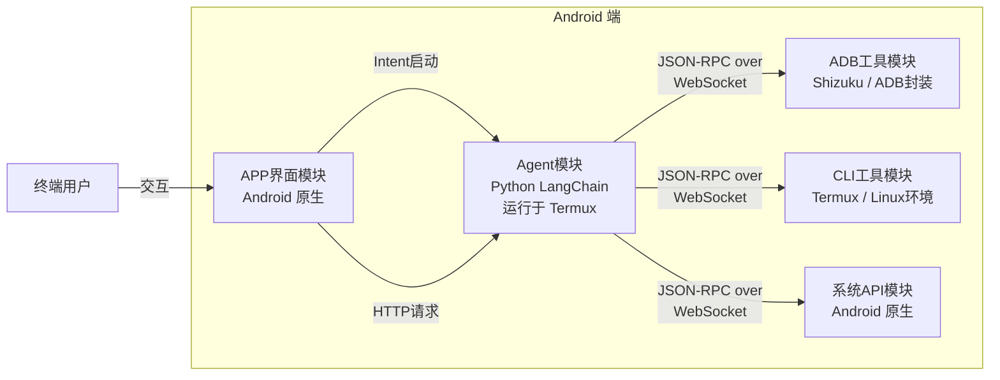

本文档介绍超级蓝心小V APP的项目架构。

## 项目架构图

## 各模块功能与技术栈说明

- **APP界面模块**：APP端使用Android原生开发，这一模块负责实现与终端用户的交互体验，提供用户界面和交互逻辑。
- **ADB工具模块**：使用Shizuku依赖，该模块负责为Agent模块提供良好定义的工具接口，并封装ADB命令的执行逻辑，是Agent操作手机的桥梁。
- **CLI工具模块**：由APP调用Termux实现，为Agent模块提供完整的Linux终端环境，用于接入各种命令行工具软件（如飞书CLI），对用户透明（感知不到），为Agent模块封装各种工具，提供统一的接口调用。
- **系统API模块**：由安卓原生开发实现，并为Agent模块暴露可用的接口。包含日程管理、闹钟、系统设置、相机、位置信息、传感器等；涵盖系统应用接口、系统本身功能。
- **Agent模块**：使用Python LangChain相关库实现，并最终打包在Android端，由Termux提供运行环境。该模块是整个系统的核心，负责处理用户输入、调用CLI工具、ADB工具等，并生成最终的输出结果。未来还可以考虑添加Skills市场，自定义提示词等功能，进一步增强Agent的能力和灵活性。部署参见https://docs.langchain.com/langsmith/deployment

## APP启动流程和常见问题

1. 安装Shizuku、Termux和ADBKeyBoard；
  1. 配置Shizuku；
  2. 配置Termux：打开 Termux，修改 ~/.termux/termux.properities 文件，添加一行：allow-external-apps = true，即允许外部应用调用。
  3. 配置ADBKeyBoard：在系统设置-语言与输入法-输入法管理中，启用ADB Keyboard，或执行adb shell ime enable com.android.adbkeyboard/.AdbIME，执行一次即可；
2. 第一次使用APP相关功能时，APP会在运行时申请相关权限；
3. 后续启动APP时，会指定一个固定端口（暂时固定），并使用Intent调用Termux，来启动Python Agent端，Agent端会监听这个端口，等待APP连接；连接成功后即可进行对话等操作。

### 断线与重连

- APP 与 Agent 的流式 Run 连接断开时，应使用 `on_disconnect: "cancel"` 取消当前 Run。
- ADB WebSocket 断开或被同一 `deviceId` 的新连接替换时，当前 Phone Subagent TODO 立即失效。
- 重连只恢复设备可用状态，不恢复旧任务；用户重新发起请求后才能执行新的手机操作。

## 调用关系及参考的实现方式

1. APP界面与ADB、CLI、系统API之间无功能上的调用关系。
2. ADB与Agent、CLI与Agent、系统API与Agent之间统一使用JSON-RPC协议，并通过WebSocket方式通信，安卓侧实现方式是ProcessBuilder逐行处理，Agent Python侧已经实现JSON-RPC。
3. APP与Agent之间使用HTTP协议通信，参见https://docs.langchain.com/langsmith/server-api-ref

## 后续技术设计问题

Agent框架的模型apiKey如何管理：未来（不考虑）开发一个浅封装的Server，提供符合openai规范（和/或anthropic规范）的接口，这样即可将apiKey保护在Server端。

## 创新点

1. 通过无障碍服务获取UI树，同时又使用屏幕截图，让AI操作手机有了眼睛和高级眼镜（？
2. 使用Shizuku执行ADB Shell命令，仅需一台手机即可实现Agent操作手机，无需电脑，提高了便携性；
3. 使用Termux在手机上运行Agent，数据全部保存在本地，保护了隐私安全。
4. 混合使用安卓原生开发和Python Agent开发，既充分利用了安卓原生开发的优势（系统应用调用、命令调用、无障碍服务利用等），又使用Python强大成熟的Agent框架加快开发速度。
